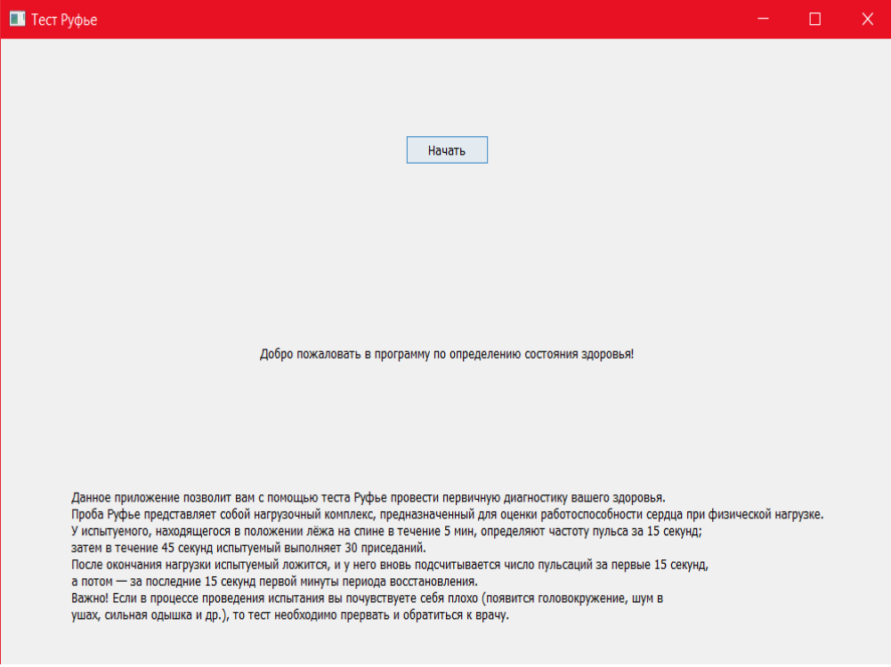

# Описание проекта
Тест Руфье — Диксона представляет собой нагрузочный комплекс, предназначенный для оценки работоспособности сердца при физической нагрузке.
Хочешь узнать свою работоспособность сердца?

## Authors

- [kakashi12394](https://github.com/kakashi12394)
- [jonotyan](https://github.com/jonotyan)
## Badges

## Screenshots

